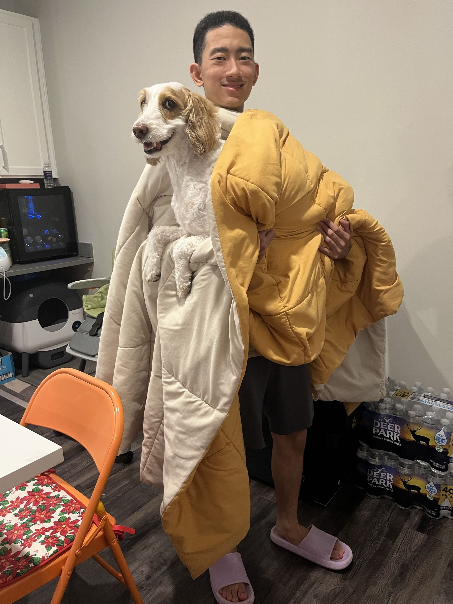

Hi! I'm Elijah Olive!

I'm a computer science senior student who is focused on quantum computing, specifically error correction. I am hoping to go to graduate school and earn a doctorates degree and make some contribution in humanity's quest to build a functioning, fault-tolerant quantum computer.

Despite my complex field of study, I have several hobbies including:

* Playing D&D
* Drawing comics
* Reading/writing fantasy novels

You can find my code on [my GitHub Profile](https://github.com/elijaholive).

I own a dog named Gook-Soo (which means "noodle" in Korean), who is a 7 year old Australian Labradoodle and a therapy dog.



***
Site last built on: 
```{r echo=FALSE}
Sys.time()
```